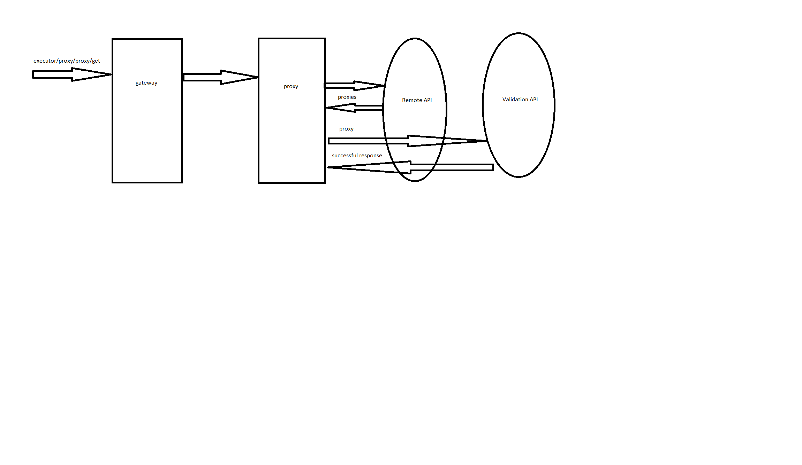

# proxy
This microservice provides an API for retrieving and validating proxies from a remote API and saving them to a database,
as well as for retrieving valid proxies from the database.

[You can also see worker microservice here, which executes scenarios and generates reports.](https://github.com/MorgothGorthaur/worker_microservice)
[and the proxy microservice here](https://github.com/victortarasov1/proxy_microservice).

you can run microservices using docker compose and see additional documentation  [here](https://github.com/victortarasov1/executor-service-docker-compose),
and change the microservice's configuration [here](https://github.com/victortarasov1/executor-service-configuration)

## Flow

### the scenario execution and generating reports flow:


### loading and validating proxy from the remote API flow:




## Proxy's API
- `GET: /executor/proxy/proxy/add` - load proxies from remote source
- `GET: /executor/proxy/proxy/get` - get proxy


## Json Examples

### Proxy Example
```json
{
  "id": "74ce8215-e6b0-4e43-9f5c-481fb3f40d42",
  "proxyNetworkConfig": {
    "id": "f89664ee-6286-4275-807d-d5ab0f85841d",
    "hostname": "45.65.137.218",
    "port": 999
  },
  "proxyCredentials": {
    "username": "",
    "password": ""
  },
  "createdAt": "2024-07-03T15:08:35.890147Z"
}

```
## Used Technologies
### Back-end:
- Spring Web
- Spring Data JPA
- Spring Actuator
- Spring Cloud Config
- Spring Cloud Eureka
- Spring Cloud OpenFeign
- AssertJ
- postgresql
- Mockito
- prometheus
- lombok
### Server build:
- gradle
- google jib

## Requirements
- java 17
- gradle